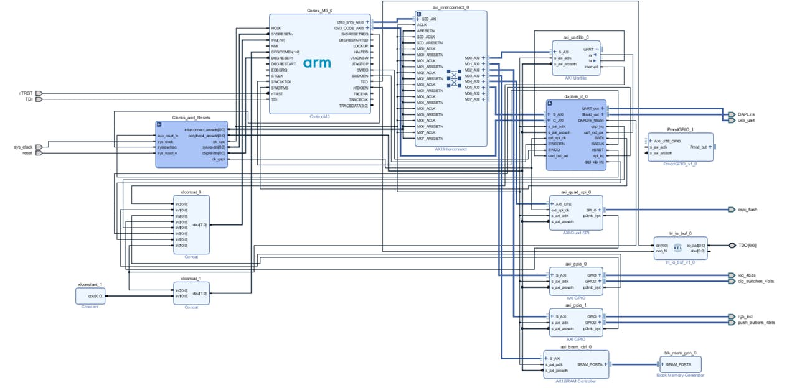

# FPGA Reaction Timer

## Overview

This was my first FPGA project, chosen to help me understand core digital design concepts—including ALUs, PRNGs, synchronous and asynchronous behavior, input debouncing—and to develop finite‑state machine implementations.

This project implements a reaction-time tester on a Digilent Nexys‑4 DDR FPGA board using VHDL. It measures how quickly a user responds to a visual prompt and displays the result on the seven-segment displays.

## Core Features

* **Countdown prompt**: Three decimal points light up and turn off sequentially.
* **Timing**: A millisecond timer starts when the last decimal point turns off and stops on center-button (BTNC) press.
* **Display**: Shows measured reaction time; pressing BTNC again clears the display and restarts.
* **Error handling**: Early button presses during the countdown show an error message.
* **Statistics** (when idle):

  * BTNR → average of last 3 runs
  * BTNU → longest of last 3 runs
  * BTND → shortest of last 3 runs
  * BTNL → reset stored data

## Extensions (pick one)

* **Random start**: Vary the countdown interval using a PRNG.
* **Configurable sample size**: Use board switches to set how many readings contribute to the stats.

## Design Highlights

* **Clock divider & decade counter** for millisecond timing
* **Finite-State Machine (FSM)** with states: `Warning3`, `Warning2`, `Warning1`, `TimerRunning`, `DisplayTime`, etc.
* **Display driver**: BCD-to-seven-segment decoder and custom text routines
* **ALU module** for computing average, min, and max
* **(Optional) PRNG** for randomized start times

## Getting Started

1. **Requirements**: Xilinx Vivado (2020 or later), Nexys‑4 DDR board
2. **Build**:

   ```bash
   vivado -mode batch -source build.tcl
   ```
3. **Program** the `.bit` file onto the FPGA via Vivado Hardware Manager.
4. **Run**: Follow on-screen prompts and use the board buttons to test and view stats.

## Testing

* Simulate individual modules in Vivado Simulator using provided testbenches.
* Verify waveforms in `tb/` before hardware deployment.

---
